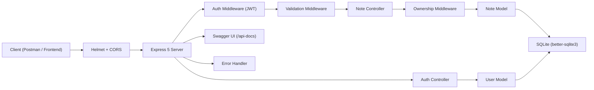

# Notes API -- Step-by-Step Build Guide

> **Archived: original build playbook.** This document is the original roadmap used to build the Notes API from scratch. The codebase may have evolved since this guide was written -- improvements, refactors, and bug fixes happen independently of the guide. See [../README.md](../README.md) for current setup, architecture, and deployment notes.

---

> **Project Summary:** A secure RESTful API for managing personal notes. Users register and authenticate with JWT, then perform full CRUD on their own notes with ownership enforcement. The API supports full-text search across titles and content, tag-based filtering, and cursor-based pagination. Security layers include Helmet HTTP headers, bcrypt password hashing, input validation and sanitization via express-validator, environment-aware error handling that hides internals in production, and request body size limiting. The server shuts down gracefully, closing both HTTP connections and the SQLite database. Interactive Swagger/OpenAPI documentation is auto-generated from JSDoc annotations. Built with Express 5, better-sqlite3, and deployed on Render.

Each step below is a self-contained prompt. Execute them in order.

Stack: `Node.js` `Express 5` `better-sqlite3 (SQLite)` `jsonwebtoken` `bcryptjs` `express-validator` `swagger-jsdoc` `swagger-ui-express` `helmet` `cors` `dotenv` `nodemon`

---

## Table of Contents

**PHASE 1 -- Backend Foundation**
- STEP 1 -- Project Scaffolding and Dependency Setup
- STEP 2 -- Environment Configuration
- STEP 3 -- Database Connection and Schema
- STEP 4 -- Express Application Entry Point

**PHASE 2 -- Authentication**
- STEP 5 -- User Model
- STEP 6 -- Auth Controller and Token Generation
- STEP 7 -- Auth Middleware (JWT Verification)
- STEP 8 -- Validation Middleware
- STEP 9 -- Auth Routes with Swagger Docs

**PHASE 3 -- Notes CRUD**
- STEP 10 -- Note Model with Search, Filter, and Pagination
- STEP 11 -- Note Controller
- STEP 12 -- Ownership Middleware
- STEP 13 -- Note Routes with Swagger Docs

**PHASE 4 -- Security and Production Hardening**
- STEP 14 -- Error Handler with Environment Awareness
- STEP 15 -- Startup Validation and Graceful Shutdown
- STEP 16 -- Swagger Configuration
- STEP 17 -- Welcome Page

**PHASE 5 -- Deploy and Documentation**
- STEP 18 -- Render Deployment Configuration
- STEP 19 -- GitHub Community Files
- STEP 20 -- README and Final Review

**Appendices**
- Appendix A -- Environment Variables
- Appendix B -- API Endpoint Reference
- Appendix C -- Common Pitfalls

---

## Global Build Rules (apply to EVERY step)

- Do **not** run `git` commands. Version control is handled manually by the developer.
- Do **not** install packages beyond those listed in the step. If a step does not mention `npm install`, do not install anything.
- Do **not** start long-running processes (`npm run dev`, `nodemon`) unless the step explicitly requests it.
- Treat every step as self-contained. Read the goal, create or edit exactly the files listed, and stop.
- Use CommonJS (`require`/`module.exports`). The project sets `"type": "commonjs"` in `package.json`.
- Use parameterized queries for all database operations. Never interpolate user input into SQL strings.
- Every route handler that can throw must forward errors to `next(err)`.

---

## Architecture at a Glance



The request lifecycle:

1. Client sends a request.
2. Helmet sets security headers; CORS allows cross-origin; JSON body is parsed with a 1 MB limit.
3. Public routes (`/`, `/api-docs`, `/api/auth/register`, `/api/auth/login`) are served directly.
4. Protected routes pass through the JWT authentication middleware, which extracts `req.user`.
5. Validation middleware checks request body/query against express-validator rules.
6. For note-specific routes, the ownership middleware verifies the note exists and belongs to `req.user`.
7. Controllers call model methods, which run parameterized SQL against SQLite.
8. Responses are sent as JSON. Errors bubble to the global error handler.

---

# PHASE 1 -- BACKEND FOUNDATION

---

## STEP 1 -- Project Scaffolding and Dependency Setup

**Goal:** Initialize the Node.js project and install all dependencies in one pass.

**Files:** `package.json`

1. Run `npm init -y` in the project root.
2. Edit `package.json` to set the metadata:

```json
{
  "name": "notes-api",
  "version": "1.0.0",
  "description": "A RESTful Notes API with JWT authentication, ownership control, and Swagger docs",
  "main": "src/app.js",
  "scripts": {
    "start": "node src/app.js",
    "dev": "nodemon src/app.js"
  },
  "keywords": ["notes", "api", "jwt", "sqlite", "rest"],
  "author": {
    "name": "Serkanby",
    "url": "https://serkanbayraktar.com/"
  },
  "license": "MIT",
  "type": "commonjs"
}
```

3. Install production dependencies:

```bash
npm install express better-sqlite3 jsonwebtoken bcryptjs express-validator swagger-jsdoc swagger-ui-express helmet cors dotenv
```

4. Install dev dependencies:

```bash
npm install --save-dev nodemon
```

5. Create the directory structure:

```
src/
  config/
  controllers/
  middleware/
  models/
  routes/
```

6. Create `.gitignore`:

```
node_modules/
.env
*.db
.DS_Store
Thumbs.db
Desktop.ini
.vscode/
.idea/
*.swp
*.swo
*.log
npm-debug.log*
coverage/
.nyc_output/
```

**Acceptance:** `npm run dev` fails with "Cannot find module `./src/app.js`" -- that is expected at this point.

---

## STEP 2 -- Environment Configuration

**Goal:** Set up dotenv-based configuration with sensible defaults.

**Files:** `.env.example`, `.env`

1. Create `.env.example` as a template for collaborators:

```
PORT=3000
JWT_SECRET=your_super_secret_key_here
JWT_EXPIRES_IN=7d
DB_PATH=./notes.db
```

2. Copy it to `.env` and set a real development secret:

```
PORT=3000
JWT_SECRET=dev_secret_change_in_production_abc123
JWT_EXPIRES_IN=7d
DB_PATH=./notes.db
```

**Acceptance:** `.env` is listed in `.gitignore`. The file is never committed.

---

## STEP 3 -- Database Connection and Schema

**Goal:** Create a reusable SQLite connection module that initializes the schema on first run.

**Files:** `src/config/database.js`

**Implementation details:**

- Use `better-sqlite3` for synchronous, high-performance SQLite access.
- Resolve `DB_PATH` from env with a fallback to `./notes.db`.
- Enable WAL journal mode for concurrent read performance.
- Enable foreign keys so `ON DELETE CASCADE` works.
- Create `users` and `notes` tables with `CREATE TABLE IF NOT EXISTS`.
- Add indexes on `notes.user_id` and `notes.tags`.
- Export `db` (the connection), `initializeDatabase` (schema creation), and `closeDatabase` (cleanup).

```sql
CREATE TABLE IF NOT EXISTS users (
  id INTEGER PRIMARY KEY AUTOINCREMENT,
  username TEXT NOT NULL UNIQUE,
  email TEXT NOT NULL UNIQUE,
  password TEXT NOT NULL,
  created_at DATETIME DEFAULT CURRENT_TIMESTAMP
);

CREATE TABLE IF NOT EXISTS notes (
  id INTEGER PRIMARY KEY AUTOINCREMENT,
  user_id INTEGER NOT NULL,
  title TEXT NOT NULL,
  content TEXT NOT NULL,
  tags TEXT DEFAULT '[]',
  created_at DATETIME DEFAULT CURRENT_TIMESTAMP,
  updated_at DATETIME DEFAULT CURRENT_TIMESTAMP,
  FOREIGN KEY (user_id) REFERENCES users(id) ON DELETE CASCADE
);

CREATE INDEX IF NOT EXISTS idx_notes_user_id ON notes(user_id);
CREATE INDEX IF NOT EXISTS idx_notes_tags ON notes(tags);
```

Key design decisions:
- Tags are stored as a JSON string (`TEXT DEFAULT '[]'`). This avoids a join table for a simple tagging use case and keeps the schema flat.
- `ON DELETE CASCADE` ensures that deleting a user automatically removes all their notes.
- The `closeDatabase` function is called during graceful shutdown (added in STEP 15).

**Acceptance:** Requiring the module does not throw. `initializeDatabase()` creates the tables. The `notes.db` file appears in the project root.

---

## STEP 4 -- Express Application Entry Point

**Goal:** Set up the Express app with security middleware, route mounting, and server startup.

**Files:** `src/app.js`

**Implementation details:**

- Load dotenv at the very top: `require("dotenv").config()`.
- Import and configure Helmet with a custom CSP that allows inline styles (needed for the welcome page and Swagger UI).
- Enable CORS for all origins.
- Parse JSON bodies with a 1 MB size limit.
- Mount Swagger UI at `/api-docs`.
- Mount auth routes at `/api/auth`.
- Mount note routes at `/api/notes`.
- Register the global error handler after all routes.
- Call `initializeDatabase()` before starting the server.
- Listen on `process.env.PORT` with a fallback to `3000`.
- Export `app` for potential testing.

At this point, the route files do not exist yet. Create placeholder files so the app does not crash:

```javascript
// src/routes/auth.js
const { Router } = require("express");
const router = Router();
module.exports = router;

// src/routes/notes.js
const { Router } = require("express");
const router = Router();
module.exports = router;
```

**Acceptance:** `npm run dev` starts the server. Visiting `http://localhost:3000/api-docs` shows an empty Swagger UI.

---

# PHASE 2 -- AUTHENTICATION

---

## STEP 5 -- User Model

**Goal:** Create a data access layer for the `users` table.

**Files:** `src/models/User.js`

**Methods to implement:**

| Method | Description |
|--------|-------------|
| `create(username, email, password)` | Hash password with bcrypt (10 salt rounds), insert row, return the new user via `findById` |
| `findById(id)` | Select `id, username, email, created_at` only -- never return the password hash |
| `findByEmail(email)` | Select all columns (needed for login password comparison) |
| `findByUsername(username)` | Select all columns (needed for duplicate check) |
| `comparePassword(plain, hashed)` | Delegate to `bcrypt.compareSync` |

Key rules:
- `findById` must exclude the `password` column from its SELECT. This prevents accidental password hash leaks in API responses.
- Use `bcrypt.hashSync` and `bcrypt.compareSync` because `better-sqlite3` is synchronous -- mixing sync DB with async bcrypt would add complexity with no benefit.

**Acceptance:** Manually calling `User.create("test", "test@test.com", "123456")` inserts a row and returns `{ id, username, email, created_at }` without a password field.

---

## STEP 6 -- Auth Controller and Token Generation

**Goal:** Implement register, login, and profile handlers.

**Files:** `src/controllers/authController.js`

**Implementation details:**

- Create a private `generateToken(user)` function that signs `{ id, username }` with `process.env.JWT_SECRET` and `process.env.JWT_EXPIRES_IN` (default `"7d"`).
- `register`: check for duplicate email and username (return `409`), create user, generate token, respond with `201`.
- `login`: find user by email, compare password (return `401` on mismatch), generate token, respond with user data (excluding password).
- `getProfile`: find user by `req.user.id` (set by auth middleware), return `404` if deleted, otherwise return user.
- Every handler wraps its logic in try/catch and calls `next(err)` on failure.

**Acceptance:** The controller exports an object with `register`, `login`, and `getProfile` methods.

---

## STEP 7 -- Auth Middleware (JWT Verification)

**Goal:** Create middleware that validates the `Authorization: Bearer <token>` header and populates `req.user`.

**Files:** `src/middleware/auth.js`

**Implementation details:**

- Extract the `Authorization` header.
- If missing or not prefixed with `"Bearer "`, respond `401`.
- Call `jwt.verify(token, process.env.JWT_SECRET)`.
- On success, set `req.user = { id: decoded.id, username: decoded.username }` and call `next()`.
- On failure (expired, malformed), respond `401`.

**Acceptance:** A request with a valid token passes through and `req.user` is populated. A request without a token or with an invalid token receives `401`.

---

## STEP 8 -- Validation Middleware

**Goal:** Create a reusable middleware that processes `express-validator` results.

**Files:** `src/middleware/validate.js`

**Implementation details:**

- Call `validationResult(req)`.
- If errors exist, respond `400` with `{ error: "Validation failed", details: [...] }` where each detail has `field` and `message`.
- If no errors, call `next()`.

This middleware is placed at the end of the validation chain in every route, after the `body()`/`query()` validators.

**Acceptance:** A POST to `/api/auth/register` with an empty body returns `400` with field-specific error messages.

---

## STEP 9 -- Auth Routes with Swagger Docs

**Goal:** Wire up auth endpoints with validation rules and OpenAPI annotations.

**Files:** `src/routes/auth.js`

**Endpoints:**

| Method | Path | Middleware | Handler |
|--------|------|-----------|---------|
| POST | `/register` | `body("username").trim().isLength({min:3, max:30})`, `body("email").isEmail().normalizeEmail()`, `body("password").isLength({min:6})`, `validate` | `authController.register` |
| POST | `/login` | `body("email").isEmail().normalizeEmail()`, `body("password").notEmpty()`, `validate` | `authController.login` |
| GET | `/profile` | `authenticate` | `authController.getProfile` |

**Swagger schemas to define in this file:**
- `BearerAuth` security scheme
- `User` schema (id, username, email, created_at)
- `AuthResponse` schema (message, user, token)
- `Error` schema (error)

Add `@swagger` JSDoc blocks above each route definition.

**Acceptance:** All three auth endpoints work. Swagger UI shows them under the "Auth" tag with request/response schemas.

---

# PHASE 3 -- NOTES CRUD

---

## STEP 10 -- Note Model with Search, Filter, and Pagination

**Goal:** Create a data access layer for the `notes` table with advanced query capabilities.

**Files:** `src/models/Note.js`

**Methods to implement:**

| Method | Description |
|--------|-------------|
| `create(userId, title, content, tags)` | Insert note, stringify tags to JSON, return via `findById` |
| `findById(id)` | Select note, parse tags from JSON string to array |
| `findAllByUser(userId, options)` | Build dynamic query with optional search, tag filter, pagination |
| `update(id, fields)` | Whitelist-based partial update, auto-set `updated_at` |
| `delete(id)` | Delete note by ID |
| `getAllTagsByUser(userId)` | Aggregate unique tags across all user notes |

**`findAllByUser` query building:**

1. Start with `SELECT * FROM notes WHERE user_id = ?`.
2. If `search` is provided, append `AND (title LIKE ? OR content LIKE ?)` with `%search%` wildcards.
3. If `tag` is provided, append `AND tags LIKE ?` with `%"tag"%` pattern (matches inside JSON array string).
4. Run a count query (same WHERE clause) for pagination metadata.
5. Append `ORDER BY updated_at DESC LIMIT ? OFFSET ?`.
6. Return `{ notes, pagination: { page, limit, total, totalPages } }`.

**`update` field whitelisting:**

Only allow `title`, `content`, and `tags` to be updated. Iterate `Object.entries(fields)`, skip undefined values and non-whitelisted keys, build `SET` clause dynamically. Always append `updated_at = CURRENT_TIMESTAMP`. If no valid fields are provided, return the current note unchanged.

**Acceptance:** Creating a note with tags `["work", "urgent"]` stores them as `'["work","urgent"]'` in the database. Querying with `?tag=work` returns that note. Querying with `?search=meeting` searches across title and content.

---

## STEP 11 -- Note Controller

**Goal:** Create controller handlers for all note operations.

**Files:** `src/controllers/noteController.js`

**Handlers:**

| Handler | Description |
|---------|-------------|
| `create` | Extract `title, content, tags` from body, call `Note.create`, respond `201` |
| `getAll` | Extract query params, parse `page`/`limit` to integers with defaults, call `Note.findAllByUser` |
| `getById` | Return `req.note` (already loaded by ownership middleware) |
| `update` | Extract fields from body, call `Note.update` on `req.note.id` |
| `delete` | Call `Note.delete` on `req.note.id` |
| `getTags` | Call `Note.getAllTagsByUser` for `req.user.id` |

The `getById` handler does not need try/catch because the ownership middleware already handles all error cases and sets `req.note`.

**Acceptance:** Full CRUD works through Postman or Swagger UI.

---

## STEP 12 -- Ownership Middleware

**Goal:** Verify that a note exists and belongs to the authenticated user.

**Files:** `src/middleware/ownership.js`

**Implementation details:**

- Parse `req.params.id` to an integer.
- If the result is `NaN` or `<= 0`, respond `400` with `"Invalid note ID"`.
- Look up the note via `Note.findById`.
- If not found, respond `404`.
- If `note.user_id !== req.user.id`, respond `403`.
- Otherwise, set `req.note = note` and call `next()`.

This middleware is applied to `GET /:id`, `PUT /:id`, and `DELETE /:id` routes.

**Acceptance:** Requesting a note owned by another user returns `403`. Requesting a non-existent note returns `404`. Requesting `/api/notes/abc` returns `400`.

---

## STEP 13 -- Note Routes with Swagger Docs

**Goal:** Wire up note endpoints with router-level auth, validation, ownership checks, and OpenAPI annotations.

**Files:** `src/routes/notes.js`

**Key design:** Apply `authenticate` at the router level with `router.use(authenticate)` so every note route requires a valid JWT.

**Endpoints:**

| Method | Path | Middleware | Handler |
|--------|------|-----------|---------|
| POST | `/` | `body("title")`, `body("content")`, `body("tags").optional()`, `validate` | `noteController.create` |
| GET | `/` | `query("page").optional()`, `query("limit").optional()`, `validate` | `noteController.getAll` |
| GET | `/tags` | -- | `noteController.getTags` |
| GET | `/:id` | `checkNoteOwnership` | `noteController.getById` |
| PUT | `/:id` | `checkNoteOwnership`, `body("title").optional()`, `body("content").optional()`, `body("tags").optional()`, `validate` | `noteController.update` |
| DELETE | `/:id` | `checkNoteOwnership` | `noteController.delete` |

**Important:** The `/tags` route must be defined before `/:id` to prevent Express from interpreting `"tags"` as an ID parameter.

**Swagger schemas to define in this file:**
- `Note` schema (id, user_id, title, content, tags, created_at, updated_at)
- `NoteInput` schema (title, content, tags)

**Acceptance:** All six note endpoints work. Swagger UI shows them under the "Notes" tag.

---

# PHASE 4 -- SECURITY AND PRODUCTION HARDENING

---

## STEP 14 -- Error Handler with Environment Awareness

**Goal:** Create a global error handler that catches all unhandled errors and returns safe responses.

**Files:** `src/middleware/errorHandler.js`

**Implementation details:**

Express 5 error handlers use the four-argument signature `(err, req, res, next)`.

Handle these specific error types:
- `err.code === "SQLITE_CONSTRAINT_UNIQUE"` -> `409 Resource already exists`
- `err.type === "entity.parse.failed"` -> `400 Invalid JSON in request body`
- `err.type === "entity.too.large"` -> `413 Request body too large`

For all other errors:
- Derive status from `err.status || err.statusCode || 500`.
- In production (`NODE_ENV === "production"`), return a generic message for `5xx` errors to prevent leaking internal details.
- In development, return `err.message` for easier debugging.
- Always log the error message to the console.

**Acceptance:** A malformed JSON body returns `400`. In production mode, a thrown error returns `"Internal server error"` without stack traces.

---

## STEP 15 -- Startup Validation and Graceful Shutdown

**Goal:** Ensure critical configuration is present before the server starts, and clean up resources on shutdown.

**Files:** `src/app.js` (modify)

**Startup validation:**

Add this block immediately after `require("dotenv").config()`:

```javascript
if (!process.env.JWT_SECRET) {
  console.error("FATAL: JWT_SECRET environment variable is not set.");
  process.exit(1);
}
```

Without `JWT_SECRET`, all token signing and verification would use `undefined` as the secret, which is a critical security failure. Failing fast is the correct behavior.

**Graceful shutdown:**

Store the server instance returned by `app.listen()`. Add signal handlers for `SIGTERM` (Render, Docker) and `SIGINT` (Ctrl+C):

```javascript
function gracefulShutdown(signal) {
  console.log(`\n${signal} received. Shutting down gracefully...`);
  server.close(() => {
    closeDatabase();
    console.log("Server closed.");
    process.exit(0);
  });
}

process.on("SIGTERM", () => gracefulShutdown("SIGTERM"));
process.on("SIGINT", () => gracefulShutdown("SIGINT"));
```

**Also in this step:**

- Move `require("../package.json")` to the top of the file (module-level) so it is loaded once at startup, not on every request to the welcome page.
- Add a `{ limit: "1mb" }` option to `express.json()`.

**Acceptance:** Removing `JWT_SECRET` from `.env` and restarting causes the server to exit with a fatal error. Pressing Ctrl+C logs a graceful shutdown message and closes the database.

---

## STEP 16 -- Swagger Configuration

**Goal:** Configure swagger-jsdoc to generate an OpenAPI 3.0 spec from JSDoc annotations.

**Files:** `src/config/swagger.js`

**Implementation details:**

- Use absolute paths (via `path.resolve(__dirname, "..")`) for the `apis` array so the spec generation works regardless of the current working directory.
- Define a development server with a `{port}` variable defaulting to `"3000"`.
- Define three tags: `General`, `Auth`, `Notes`.

```javascript
apis: [
  path.join(srcDir, "app.js"),
  path.join(srcDir, "routes", "*.js"),
],
```

**Acceptance:** Visiting `/api-docs` shows all endpoints grouped by tag with request/response schemas.

---

## STEP 17 -- Welcome Page

**Goal:** Serve a themed HTML page at the root URL.

**Files:** `src/app.js` (modify)

**Implementation details:**

- Add a `GET /` handler that returns an HTML string.
- The page uses a notebook/paper theme with lined background and a red margin line.
- Display the API name, version (from `package.json`), and links to Swagger docs and the auth profile endpoint.
- Add a footer with the developer name and links.
- Include responsive styles for mobile.
- Add an `@openapi` JSDoc block so the endpoint appears in Swagger.

Helmet's default CSP blocks inline styles. The CSP override in the Helmet configuration (STEP 4) adds `"'unsafe-inline'"` to the `style-src` directive to allow the welcome page styles.

**Acceptance:** Visiting `http://localhost:3000/` shows a styled welcome page with working links.

---

# PHASE 5 -- DEPLOY AND DOCUMENTATION

---

## STEP 18 -- Render Deployment Configuration

**Goal:** Add a `render.yaml` blueprint for one-click Render deployment.

**Files:** `render.yaml`

```yaml
services:
  - type: web
    name: notes-api
    runtime: node
    plan: free
    buildCommand: npm install
    startCommand: node src/app.js
    envVars:
      - key: JWT_SECRET
        generateValue: true
      - key: JWT_EXPIRES_IN
        value: 7d
      - key: DB_PATH
        value: /opt/render/project/src/notes.db
      - key: NODE_ENV
        value: production
```

**Notes:**
- `generateValue: true` makes Render auto-generate a random JWT secret on first deploy.
- Render's free tier uses ephemeral storage. The SQLite database resets on each deploy. For persistent data, upgrade to a Render Disk or switch to PostgreSQL.
- `NODE_ENV=production` activates the environment-aware error handling from STEP 14.

**Acceptance:** Pushing to GitHub and connecting to Render auto-detects the blueprint. The API runs at the assigned `.onrender.com` URL.

---

## STEP 19 -- GitHub Community Files

**Goal:** Add standard open-source community health files.

**Files:**

| File | Purpose |
|------|---------|
| `.github/ISSUE_TEMPLATE/bug_report.yml` | Structured bug report form with OS, browser, severity dropdowns |
| `.github/ISSUE_TEMPLATE/feature_request.yml` | Feature suggestion form with priority and category |
| `.github/ISSUE_TEMPLATE/config.yml` | Disable blank issues, link to security policy and discussions |
| `.github/PULL_REQUEST_TEMPLATE.md` | PR checklist with change type, test steps, screenshots table |
| `.github/CODE_OF_CONDUCT.md` | Contributor Covenant v2.0 |
| `.github/CONTRIBUTING.md` | Contribution guide with setup steps, commit format, branch naming |
| `.github/SECURITY.md` | Responsible disclosure policy |
| `LICENSE` | MIT License |

All community files live under `.github/` so GitHub Community Standards detects them automatically.

**Acceptance:** The repository's "Community Standards" page on GitHub shows all items checked.

---

## STEP 20 -- README and Final Review

**Goal:** Write a comprehensive README and perform a final review of the entire project.

**Files:** `README.md`

**README sections:**

1. Title with badge links (Created by, GitHub)
2. Features list
3. Live Demo links
4. Technologies
5. Installation (clone, install, env setup, start)
6. Usage (step-by-step API workflow)
7. How It Works (auth flow, ownership control, database schema, architecture)
8. API Endpoints tables (Auth, Notes, Query Parameters)
9. Customization (middleware, database, schema extension)
10. Project Structure tree
11. Deployment (Render steps)
12. Features in Detail (completed and future)
13. Contributing
14. License
15. Developer info
16. Contact

**Final review checklist:**

- [ ] All 9 API endpoints respond correctly
- [ ] JWT auth flow works (register, login, use token)
- [ ] Ownership enforcement blocks cross-user access
- [ ] Search, tag filter, and pagination work
- [ ] Swagger UI shows all endpoints with schemas
- [ ] Invalid requests return proper validation errors
- [ ] Missing JWT_SECRET prevents server startup
- [ ] Graceful shutdown closes DB connection
- [ ] Production mode hides internal error messages
- [ ] `.env` is gitignored

---

# Appendix A -- Environment Variables

| Variable | Required | Default | Description |
|----------|----------|---------|-------------|
| `PORT` | No | `3000` | HTTP server port |
| `JWT_SECRET` | **Yes** | -- | Secret key for signing and verifying JWT tokens. Server refuses to start without it. |
| `JWT_EXPIRES_IN` | No | `7d` | Token expiration duration (e.g., `1h`, `7d`, `30d`) |
| `DB_PATH` | No | `./notes.db` | Path to the SQLite database file |
| `NODE_ENV` | No | -- | Set to `production` to hide internal error messages in API responses |

---

# Appendix B -- API Endpoint Reference

### Public Endpoints

| Method | Path | Description |
|--------|------|-------------|
| GET | `/` | Welcome page (HTML) |
| GET | `/api-docs` | Interactive Swagger documentation |
| POST | `/api/auth/register` | Register a new user |
| POST | `/api/auth/login` | Login and receive JWT token |

### Protected Endpoints (require `Authorization: Bearer <token>`)

| Method | Path | Description |
|--------|------|-------------|
| GET | `/api/auth/profile` | Get current user profile |
| POST | `/api/notes` | Create a new note |
| GET | `/api/notes` | List notes (search, tag, pagination) |
| GET | `/api/notes/tags` | Get all unique tags |
| GET | `/api/notes/:id` | Get a specific note |
| PUT | `/api/notes/:id` | Update a note |
| DELETE | `/api/notes/:id` | Delete a note |

### Query Parameters for `GET /api/notes`

| Parameter | Type | Default | Description |
|-----------|------|---------|-------------|
| `search` | string | -- | Full-text search in title and content |
| `tag` | string | -- | Filter by tag name |
| `page` | integer | `1` | Page number (min: 1) |
| `limit` | integer | `20` | Items per page (min: 1, max: 100) |

---

# Appendix C -- Common Pitfalls

**1. `JWT_SECRET` is undefined**
If you forget to create `.env` or omit `JWT_SECRET`, the server now exits on startup with a fatal error. Before the startup validation was added, the app would silently sign tokens with `undefined`, making all tokens trivially forgeable.

**2. Tags stored as JSON strings**
Tags are stored as a JSON-serialized string in a TEXT column (e.g., `'["work","urgent"]'`). Every model method that reads tags must `JSON.parse` them, and every method that writes tags must `JSON.stringify` them. Forgetting this causes the API to return raw strings instead of arrays.

**3. Route order matters for `/tags` vs `/:id`**
Express matches routes in definition order. If `/:id` is defined before `/tags`, a request to `/api/notes/tags` will match `/:id` with `id = "tags"`. Always define `/tags` first.

**4. Ownership check before validation on PUT**
The PUT route runs `checkNoteOwnership` before body validators. This is intentional -- there is no point validating a request body for a note that does not exist or does not belong to the user. The ownership check short-circuits with `404` or `403` before validation runs.

**5. Render ephemeral storage**
Render's free tier does not persist files between deploys. The SQLite database resets on every deploy. This is acceptable for a demo/portfolio project. For production, use a Render Disk or migrate to PostgreSQL.

**6. `path.resolve` vs relative paths**
`path.resolve("./notes.db")` resolves relative to the current working directory, not the script location. This works when running `npm start` from the project root, but can break if the process is started from a different directory. Swagger's `apis` paths use `path.resolve(__dirname, "..")` to avoid this issue.
